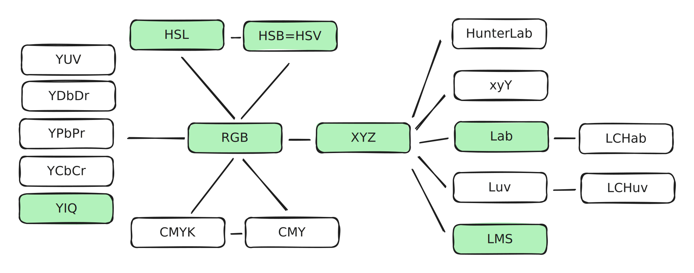

# string.h

## Overview

1. 字符串 = 真正的字符串内容+'\0'，'\0'用来代表字符串结束。
2. scanf 和printf用 %s 占位字符串

## Functions

## Reference

\[1] [https://www.runoob.com/cprogramming/c-standard-library-string-h.html](https://www.runoob.com/cprogramming/c-standard-library-string-h.html)

