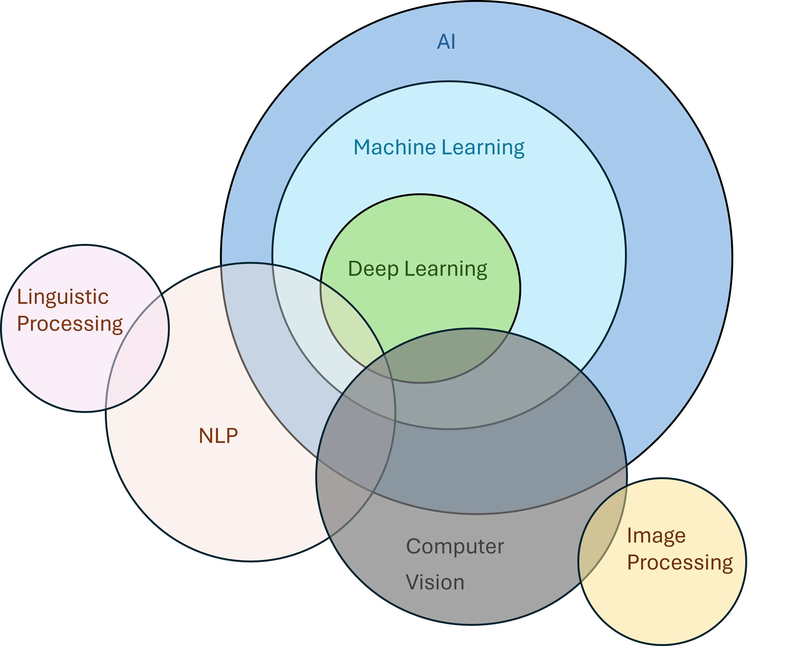

# Image Feature

## Color

### 颜色直方图

1. 一般颜色直方图：某个色彩通道的直方图。

<figure><figcaption></figcaption></figure>

<details>

<summary>Code</summary>

```python
from skimage import exposure,data
from matplotlib import pyplot as plt

image =data.coffee()

hist_r=exposure.histogram(image[:,:,0],nbins=256)
hist_g=exposure.histogram(image[:,:,1],nbins=256)
hist_b=exposure.histogram(image[:,:,2],nbins=256)

plt.subplot(1, 4, 1)
plt.imshow(image, cmap='gray')
plt.title('Original Image')
plt.axis('off')

plt.subplot(1, 4, 2)
plt.plot(hist_r[1], hist_r[0], color='red')
plt.title('Hist of R')

plt.subplot(1, 4, 3)
plt.plot(hist_g[1], hist_g[0], color='green')
plt.title('Hist of G')

plt.subplot(1, 4, 4)
plt.plot(hist_b[1], hist_b[0], color='blue')
plt.title('Hist of B')

plt.tight_layout()
plt.show()
```

</details>

2. 全局累加直方图：当图像中的特征并不能取遍所有可取值时，**统计直方图中会出现一些零值**。这些零值的出现会对相似性度量的计算带来影响，从而使得相似性度量并不能正确反映图像之间的颜色差别。

<figure><figcaption></figcaption></figure>

<details>

<summary>Code</summary>

```python
from skimage import data, exposure
from matplotlib import pyplot as plt
import numpy as np

# image = exposure.equalize_hist(data.chelsea())
image = data.cat()

bins = np.arange(256)
hist_r,bins=np.histogram(image[:,:,0], bins=bins, density=False)
hist_g,_=np.histogram(image[:,:,1], bins=bins, density=False)
hist_b,_=np.histogram(image[:,:,2], bins=bins, density=False)
hist_add=(hist_r+hist_g+hist_b)

plt.subplot(2, 5, 1)
plt.imshow(image, cmap='gray')
plt.title('Original Image')
plt.axis('off')

plt.subplot(2, 5, 2)
plt.plot(bins[:-1], hist_r, color='red')
plt.title('Hist of R')

plt.subplot(2, 5, 3)
plt.plot(bins[:-1], hist_g, color='green')
plt.title('Hist of G')

plt.subplot(2, 5, 4)
plt.plot(bins[:-1], hist_b, color='blue')
plt.title('Hist of B')

plt.subplot(2, 5, 5)
plt.plot(bins[:-1], hist_add, color='gray')
plt.title('Hist of Added')

image = exposure.equalize_hist(image)
image = (255.0*np.array(image)).astype(np.uint8)

bins = np.arange(256)
hist_r,bins=np.histogram(image[:,:,0], bins=bins, density=False)
hist_g,_=np.histogram(image[:,:,1], bins=bins, density=False)
hist_b,_=np.histogram(image[:,:,2], bins=bins, density=False)
hist_add=(hist_r+hist_g+hist_b)

plt.subplot(2, 5, 6)
plt.imshow(image, cmap='gray')
plt.title('Histed Image')
plt.axis('off')

plt.subplot(2, 5, 7)
plt.bar(bins[:-1], hist_r, color='red')
plt.title('Hist of R')

plt.subplot(2, 5, 8)
plt.bar(bins[:-1], hist_g, color='green')
plt.title('Hist of G')

plt.subplot(2, 5, 9)
plt.bar(bins[:-1], hist_b, color='blue')
plt.title('Hist of B')

plt.subplot(2, 5, 10)
plt.bar(bins[:-1], hist_add, color='gray')
plt.title('Hist of Added')

plt.tight_layout()
plt.show()
```

</details>

3. 主色调直方图

在一幅图像中，不同颜色值出现的概率不尽相同，且通常情况下少数几种颜色就能涵盖整幅图像的主色调。基于该思想，主色调直方图法会计算出图像中每种颜色出现的频率，选择出现频率最高的几种颜色并将其作为主色调。使用主色调直方图并不会降低颜色直方图匹配的效果，反而会抑制图像非主要成分的噪声，降低噪声对图像匹配的影响。


全局累加直方图与主色调直方图在 google 都搜不到！也没有别人的代码实现，这两个特征的真实性有待考察！


### 颜色矩

一阶矩可以表征该颜色通道的平均响应强度

$$
\mu_i = \frac{1}{N}\sum_{j=1}^NP_{ij}
$$

二阶矩可以表示该颜色通道的响应方差

$$
\sigma_i = [\frac{1}{N}\sum_{j=1}^N(P_{ij}-\mu_i)^2]^\frac{1}{2}
$$

三阶矩可以表征该颜色通道数据分布的偏移度

$$
s_i = [\frac{1}{N}\sum_{j=1}^N(P_{ij}-\mu_i)^3]^\frac{1}{3}
$$


$$p_{ij}$$表示数字图像P的第i个图像通道的第j个像素的像素值，N表示图像中像素的个数


<details>

<summary>Code</summary>

```python
from skimage import data
import numpy as np
from scipy import stats
image=data.coffee()
#求 RGB图像的颜色矩特征，共9 维特征
#定义3×3 数组，分别对RGB图像的3个通道求均值、方差、偏移量
features=np.zeros(shape=(3,3))
#遍历图像的3个通道
for k in range(image.shape[2]):
    #求均值
    mu=np.mean(image[:,:,k])
    #求方差
    delta=np.std(image[:,:,k])
    #求偏移量
    skew=np.mean(stats.skew(image[:,:,k]))
    features[0,k]=mu
    features[1,k]=delta
    features[2,k]=skew
print(features) 
# [[158.5690875   85.794025    51.48475   ]
#  [ 62.97286712  60.95810371  52.93569362]
#  [ -0.71812328   0.53207991   1.36080834]]
```

</details>

<details>

<summary>颜色矩有什么用（GPT）</summary>

颜色矩在图像处理领域中扮演着重要的角色，它们被用来描述和量化图像的颜色分布。以下是颜色矩的一些主要用途：

1. **颜色特征提取**：颜色矩可以作为图像的特征提取方法，用于描述图像颜色的空间分布和强度变化。通过计算图像中不同颜色通道（如红色、绿色、蓝色等）的均值、方差、熵等统计量，可以得到一组具有代表性的颜色特征向量。这些特征向量可以用来表示图像的颜色模式，从而进行图像分类、检索和分析。
2. **图像去噪**：在图像去噪过程中，颜色矩可以帮助区分噪声和有用信号。例如，高斯噪声通常会在整个图像上均匀分布，而真实图像中的颜色模式则往往呈现出特定的结构。因此，可以使用颜色矩来检测这种结构，并通过去除与结构无关的噪声成分来提高图像的质量。
3. **图像增强**：颜色矩也可以用于图像增强。通过调整图像中各颜色通道的亮度、对比度和饱和度，可以改善图像的可视性和可读性。例如，可以通过增加图像中某些颜色通道的权重来强调其重要性，从而使图像中的特定区域或特征更加突出。
4. **图像压缩**：在图像压缩过程中，颜色矩可以帮助减少数据的冗余度。通过编码图像中常见的颜色模式，可以将图像转换为一种更紧凑的形式。这样，即使在压缩后，仍然能够恢复出高质量的图像。
5. **图像风格迁移**：在图像风格迁移任务中，颜色矩可以作为目标风格的描述符。通过比较源图像和目标图像的颜色矩，可以指导风格转换过程，使得生成的图像更接近目标风格。
6. **图像识别与理解**：在图像识别和理解任务中，颜色矩可以作为机器学习模型的输入特征。例如，在物体识别任务中，颜色矩可以用来描述物体的颜色特征，从而帮助模型更好地识别和分类物体。
7. **艺术创作**：艺术家和设计师也可以利用颜色矩来进行艺术创作。通过分析和理解图像中的颜色模式，可以创造出更具视觉吸引力和情感表达力的作品。 总之，颜色矩是一种强大的图像处理工具，它可以在多种不同的应用场景中发挥作用，从图像去噪、增强到风格迁移和艺术创作，展示了其在图像处理领域的广泛适用性。

</details>

### 颜色集

颜色集又可以称为颜色索引集，其是对图像颜色直方图的一种近似。

方案一：通过颜色直方图


其实我看就是对颜色直方图进行一遍筛选。


1. 将图像从RGB颜色空间转换到HSV颜色空间等视觉均衡的颜色空间，并将颜色空间量化为若干个边长均等的小立方体；
2. 使用基于色彩的自动分割技术将图像划分为若干个子区域；
3. 使用颜色量化空间中的某个颜色分类索引每个子区域，以将图像表示为一个二进制的颜色索引集。

最简单的颜色集可以通过在颜色直方图的基础上设置阈值形成。如给定某一颜色值m，给定其阈值τm，由颜色直方图生成颜色集c可表示为：

$$
c[m]=\begin{cases}1&h[m]≥\tau_m\\0&others\end{cases}
$$

方案二：通过色彩空间变换再量化来减少颜色

1. 像素矢量表示对于RGB空间中的任意图像，它的每个像素均可表示为一个矢量\[插图]=(r,g,b)，其中r、g、b分别代表红、绿、蓝颜色分量。
2. 颜色空间转换通过变换运算T将图像变换到一个与人视觉一致的颜色空间\[插图]，即\[插图]。
3. 颜色集索引采用量化器（QM）对\[插图]重新量化，使得视觉上明显不同的颜色对应不同的颜色集，并将颜色集映射成索引m。
4. 颜色集表示设BM是M维的二值空间，在该空间中每个轴对应唯一的索引m。一个颜色集就是BM二值空间中的一个二维矢量，它表示对颜色{m}的选择，即颜色m出现时，c\[m]=1，否则c\[m]=0。

### 颜色聚合向量


颜色集，是对颜色直方图的筛选。颜色聚合向量，是表示颜色间的关系，代表颜色的变化。


颜色聚合向量是在颜色直方图的基础之上做的进一步运算。**其核心思想是将属于颜色直方图的每个颜色量化区间的像素分为两部分，如果该颜色量化区间中的某些像素占据的连续区域的面积大于指定阈值，则将该区域内的像素作为聚合像素，否则作为非聚合像素**。

颜色聚合向量可表示为<(α1,β1),,(αn,βn)>，其中αi与βi分别代表颜色直方图的第i个颜色量化区间中的聚合像素和非聚合像素的数量。颜色聚合向量除了包含颜色频率信息外，也包含颜色的部分空间分布信息，因此其可以获得比颜色直方图更好的表示效果。颜色聚合向量算法的步骤如下。

1\. 量化：颜色聚合向量算法的第一步与求普通的颜色直方图类似，即对图像进行量化处理。一般采用均匀量化处理方法，量化的目标是使图像中只保留有限个颜色区间。

2\. 连通区域划分针对重新量化后的像素值矩阵，根据像素间的连通性把图像划分成若干个连通区域。

3\. 判断聚合性统计每个连通区域中的像素数目，根据设定的阈值判断该区域中的像素是聚合的，还是非聚合，得出每个颜色区间中聚合像素和非聚合像素的数量αi和βi。

4\. 聚合向量形成图像的聚合向量可以表示为〈(α1,β1),,(αn,βn)〉。

### 颜色相关图


颜色相关图 = 颜色聚合向量 + 位置信息


颜色相关图是图像颜色分布的另外一种表达方式。颜色相关图不仅可以显示像素在图像中的占比，也可以反映不同颜色对间的空间位置的相关性。颜色相关图利用颜色对间的相对距离分布来描述空间位置信息。

$$
\gamma_{i,j}^{(k)}=\underset{p_1\in I_{(i)}, p_2\in I}{\operatorname{P}}[p_2\in I_{(j)}\mid |p_1-p_2|=k]
$$

<figure><figcaption></figcaption></figure>

<details>

<summary>Code</summary>

```python
import numpy as np
from skimage.data import coffee
from matplotlib import pyplot as plt
def isValid(X, Y, point):
    """
    判断某个像素是否超出图像空间范围
    """
    if point[0] < 0 or point[0] >= X:
        return False
    if point[1] < 0 or point[1] >= Y:
        return False
    return True
def getNeighbors(X, Y, x, y, dist):
    """
    Find pixel neighbors according to various distances
    """
    cn1 = (x + dist, y + dist)
    cn2 = (x + dist, y)
    cn3 = (x + dist, y - dist)
    cn4 = (x, y - dist)
    cn5 = (x - dist, y - dist)
    cn6 = (x - dist, y)
    cn7 = (x - dist, y + dist)
    cn8 = (x, y + dist)
    points = (cn1, cn2, cn3, cn4, cn5, cn6, cn7, cn8)
    Cn = []
    for i in points:
        if isValid(X, Y, i):
            Cn.append(i)
    return Cn
def corrlogram(image,dist):
    XX,YY,tt=image.shape
    cgram=np.zeros((256,256),dtype=np.uint32)
    for x in range(XX):
        for y in range(YY):
            for t in range(tt):
                color_i=image[x,y,t]
                neighbors_i=getNeighbors(XX,YY,x,y,dist)
                for j in neighbors_i:
                    j0=j[0]
                    j1=j[1]
                    color_j=image[j0,j1,t]
                    cgram[color_i,color_j]=cgram[color_i,color_j]+1
    return cgram

image=coffee()
dist=4
cgram=corrlogram(image,dist)
plt.subplot(1,2,1)
plt.imshow(cgram)
plt.subplot(1,2,2)
plt.imshow(np.log(cgram+1))# 看不清，所以用 log 减少一下像素亮度差异
plt.show()
```

</details>

***

## Texture

<details>

<summary>Overview</summary>

播客中的图片\[1]

综述总结\[2]

[https://github.com/cgreen259/Texture-Toolbox](https://github.com/cgreen259/Texture-Toolbox)


</details>

### 统计纹理分析方法

#### AutoCorrelation Function（自相关函数）\[4]

> * [https://medium.com/@krzysztofdrelczuk/acf-autocorrelation-function-simple-explanation-with-python-example-492484c32711](https://medium.com/@krzysztofdrelczuk/acf-autocorrelation-function-simple-explanation-with-python-example-492484c32711)


注意下面的公式 range 是matlab 对图像的索引，所以从 1 开始，如果用 Python就要再减一


$$
\rho(x,y)=\frac{\frac{1}{(N_i-\left|x\right|)(N_j-\left|y\right|)}\sum_{i}\sum_{j}I(i,j)I(i+x,j+y)}{\frac{1}{N_i N_j}\sum_{i=1}^{N_i}\sum_{j=1}^{N_j}I(i,j)^2}
$$

| condition | range of i | range of y |
| --------- | ---------- | ---------- |
| x≥0, y≥0  | \[1, Ni-x] | \[1, Nj-y] |
| x≥0, y<0  | \[1, Ni-x] | \[1-y, Nj] |
| x<0, y≥0  | \[1-x, Ni] | \[1, Nj-y] |
| x<0, y<0  | \[1-x, Ni] | \[1-y, Nj] |

<figure><figcaption><p>为了增强可视化效果，图2 中间我扣下了一部分</p></figcaption></figure>

<details>

<summary>Code</summary>

```python
from skimage import data
import matplotlib.pyplot as plt
import numpy as np

def calculate(image):
    # 创建一个与图像大小相同的零矩阵
    (Ni, Nj) = image.shape
    corr_mat = np.zeros(image.shape)
    
    # 遍历图像中的每个像素点
    assert(image.shape[0]%2 == 1)
    assert(image.shape[1]%2 == 1)
    half = int(image.shape[1]/2)
    for _x in range(image.shape[0]):
        for _y in range(image.shape[1]):
            # 计算公式中的参数
            x = _x - half # 因为公式里边的 x 和 y 是 matlab 的
            y = _y - half # 所以要从 1 开始
            si = 1 if x>= 0 else 1-x
            ei = Ni-x if x>=0 else Ni
            sj = 1 if y>=0 else 1-y
            ej = Nj-y if y>=0 else Nj

            # 计算 rho
            a = (Ni-np.abs(x))*(Nj-np.abs(y))
            b = Ni*Nj
            c = np.sum(image[si-1:ei,sj-1:ej] * image[si-1+x:ei+x,sj-1+y:ej+y])
            d = np.sum(image[:Ni,:Nj]**2)
            corr_mat[_x, _y] = (c*b)/(d*a)
    
    # 返回自相关函数
    return corr_mat

# image = data.brick()[:400:2,:400:2][:-1,:-1] # Quicker
image = data.brick()[:-1,:-1]
plt.subplot(1,4,1)
plt.imshow(image,cmap='gray')
plt.subplot(1,4,2)
corr_mat = calculate(image)
# corr_mat[99,99] = 1.17  # Quicker
corr_mat[255,255] = 1.17 # Just For Vis
plt.imshow(corr_mat,cmap='gray')

image = data.checkerboard()[:-1,:-1]
plt.subplot(1,4,3)
plt.imshow(image,cmap='gray')
plt.subplot(1,4,4)
corr_mat = calculate(image)
plt.imshow(corr_mat,cmap='gray')
plt.show()
```

</details>

<details>

<summary> 书中的描述与例子[4]</summary>

.png>).png>)

</details>

#### 边界频率

#### 灰度共生矩阵


### Laws纹理能量测量法


### Gabor变换


### 局部二值模式（BLP）

## Shape


## Edge


## Point


## Reference

\[1] [https://blog.51cto.com/u\_13984132/5477443](https://blog.51cto.com/u\_13984132/5477443)

\[2] [https://hal.science/hal-02126655v1/file/Texture\_Feature\_Extraction\_Methods\_A\_Survey.pdf](https://hal.science/hal-02126655v1/file/Texture\_Feature\_Extraction\_Methods\_A\_Survey.pdf)

\[3] [https://github.com/cgreen259/Texture-Toolbox](https://github.com/cgreen259/Texture-Toolbox)

\[4] M. Petrou and P. G. Sevilla, Image Processing: Dealing With Texture, vol. 1. Chichester, U.K.: Wiley, 2006.
