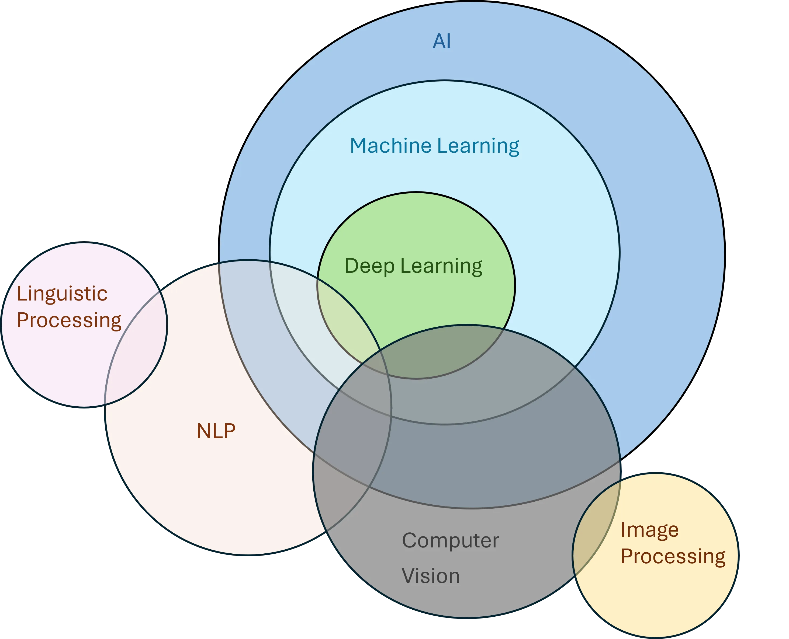

# Image

### Image

图像就是数组，每个像素点的颜色是响应值。

```python
import skimage.data as data
from PIL import Image

image = Image.fromarray(data.astronaut())

image.show()
```

<figure><figcaption></figcaption></figure>

<pre class="language-python"><code class="lang-python"><strong>print(data.__all__)
</strong><strong>['astronaut', 'binary_blobs', 'brain', 'brick', 'camera', 'cat', 'cell', 'cells3d', 'checkerboard', 'chelsea', 'clock', 'coffee', 'coins', 'colorwheel', 'data_dir', 'download_all', 'eagle', 'file_hash', 'grass', 'gravel', 'horse', 'hubble_deep_field', 'human_mitosis', 'immunohistochemistry', 'kidney', 'lbp_frontal_face_cascade_filename', 'lfw_subset', 'lily', 'logo', 'microaneurysms', 'moon', 'nickel_solidification', 'page', 'palisades_of_vogt', 'protein_transport', 'retina', 'rocket', 'shepp_logan_phantom', 'skin', 'stereo_motorcycle', 'text', 'vortex']
</strong></code></pre>

### Sampling

```python
import numpy as np
import matplotlib.pyplot as plt

def generate_image(width, height):
    I = np.zeros((width, height))
    for x in range(width):
        for y in range(height):
            I[x, y] = np.cos(x/width*2*np.pi) * np.cos(y/height*2*np.pi) * 255
    return I

plt.subplot(1,4,1)
plt.imshow(generate_image(5, 5), cmap='gray')
plt.title("5x5")
plt.axis('off')
plt.subplot(1,4,2)
plt.imshow(generate_image(15, 15), cmap='gray')
plt.title("15x15")
plt.axis('off')
plt.subplot(1,4,3)
plt.imshow(generate_image(50, 50), cmap='gray')
plt.title("50x50")
plt.axis('off')
plt.subplot(1,4,4)
plt.imshow(generate_image(1000, 1000), cmap='gray')
plt.title("1000x1000")
plt.axis('off')
plt.show()
```

<figure><figcaption></figcaption></figure>
