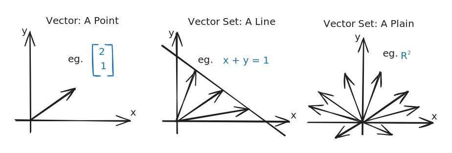

# Vector and Matrix

## RoadMap

* What is Vector

* What is Matrix

*

## Reference

\[1] [Linear Algebra Lecture 3: Vector](https://www.youtube.com/watch?v=tpNFMU7KsEU\&list=PLJV\_el3uVTsNmr39gwbyV-0KjULUsN7fW\&index=3)

\[2] [Linear Algebra Lecture 4: Matrix](https://www.youtube.com/watch?v=FInagysEI0o\&list=PLJV\_el3uVTsNmr39gwbyV-0KjULUsN7fW\&index=4)
