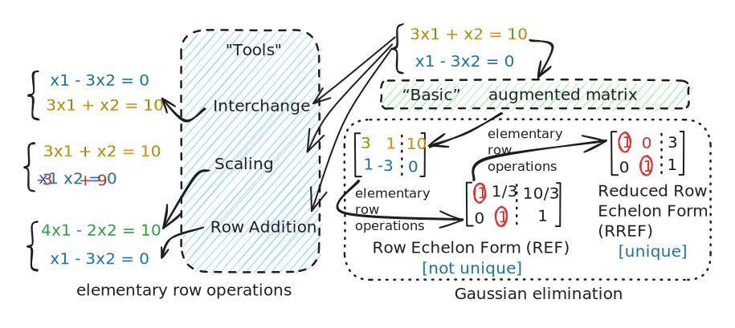

# Solve Equation

## RoadMap

## Reference

\[1] [Linear Algebra Lecture 8: Solving System of Linear Equations (part 1)](https://www.youtube.com/watch?v=zuTH1WdREkY\&list=PLJV\_el3uVTsNmr39gwbyV-0KjULUsN7fW\&index=8)

\[2] [Linear Algebra Lecture 9: Solving System of Linear Equations (part 2)](https://www.youtube.com/watch?v=YzAg9l9FO7Y\&list=PLJV\_el3uVTsNmr39gwbyV-0KjULUsN7fW\&index=9)
